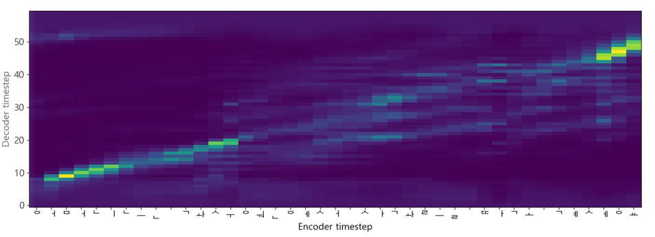

# Tensorflow_Tacotron1_TTS
Tacotron1과 음성데이터를 이용한 TTS만들기


참조  
chldkato님 gitgub  
https://github.com/chldkato/Tacotron-Korean-Tensorflow2

## 1. 실행환경 만들기
### 1-1 Anaconda3 설치 및 가상환경 만들기
Anaconda3(https://www.anaconda.com/products/individual) 사이트에 들어가서 중간쯤 내리면 다운로드 페이지가 나오는데 본인의 환경에 맞는 Anaconda3를 다운로드 및 설치를 해줍니다.

설치가 완료되면 Anaconda Prompt를 실행한 후 가상환경을 만들어 줍니다.  
```
conda create -n tensorflow python=3.8
```
여기서는 tensorflow라는 이름의 가상환경을 파이썬 버전 3.8로 하여 만들겠습니다.

가상환경이 만들어지면 
```
activate tensorflow
```
명령을 사용해 가상환경으로 들어가줍니다.  
prompt에 (base)가 아닌 (tensorflow)로 시작하게 바뀌었다면 제대로 들어온 것입니다.

## 2. 학습에 필요한 데이터셋 만들기
이 코드에서는 Kaggle에서 제공하는 KSS데이터 셋을 다운받아 사용했습니다.  (https://www.kaggle.com/bryanpark/korean-single-speaker-speech-dataset)  
다운로드 받아 압축을 푼 후 코드가 있는 프로젝트 폴더에 이미지와 같이 넣어주시면 됩니다.  

  
그 후 같은 구글 드라이브 폴더안에 있는 models와 util폴더도 다운로드 받아 코드와 같은 경로에 넣어줍니다.  


## 3. 코드 실행
anaconda prompt에서 가까 만들었던 가상환경으로 접속한 후 코드가 있는 폴더로 이동해 줍니다.  
  ```
  cd 코드가 있는 파일 경로
  ```   
이동했으면 train1.py코드를 싱행시켜서 학습해 줍니다.  
```
python train1.py
```

